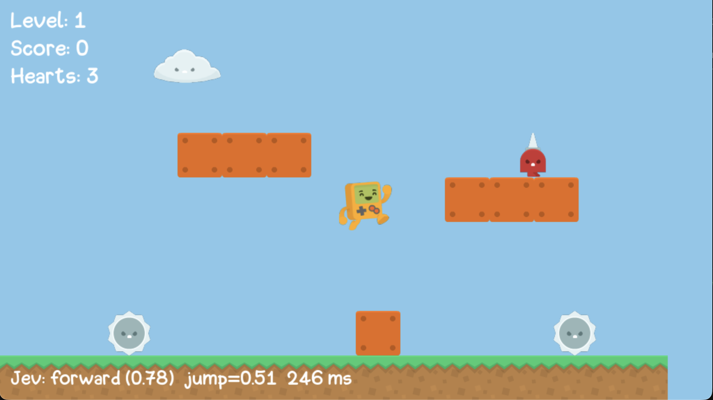

# Jev plays a platformer

A tiny fun project: [Jev](https://typesafe.ai) - TypeSafe AI's "System One"
model that answers with calibrated numbers instead of text - plays a pygame
platformer. Fast gut decisions, no chat, no reasoning chains.



## How it works

Every 6 frames:

1. **Look** - code reads the game objects and describes the situation in plain
   text: is there a wall ahead, is the hero at the edge of a pit, what are the
   enemies doing, plus a small ASCII map.
2. **Decide** - one Jev call, two questions: *move* (forward / wait / back)
   and *jump* (yes/no probability).
3. **Act** - the hero moves. The game pauses while Jev thinks (~250 ms), so
   the timing stays exact.

A small safety net only cancels moves that are certain death (like stepping
off a pit edge without jumping). In the final test runs it never had to.

## Levels

- **Level 1** - wait behind a wall while a spikeball rolls in, jump a pit,
  get through a corridor with a bouncing spikeball.
- **Level 2** - climb a tower, hop over a chasm on a stepping stone, wait at a
  pit until the patrolling spikeman walks away, then jump over it.

Jev beats both with no hearts lost, for under a cent per run.

## Run

```bash
pip install -r requirements.txt
cp .env.example .env            # add your TYPESAFE_API_KEY

python run.py jev               # watch Jev play (space to start)
python run.py jev --level 2     # start from level 2
python run.py manual            # play yourself
python eval.py                  # headless run with results and cost
```

## Credits

The game is [joncoop/pygame-platformer](https://github.com/joncoop/pygame-platformer)
(MIT), copied unchanged into `game/`. The two levels in `levels/` are made for
this project.
